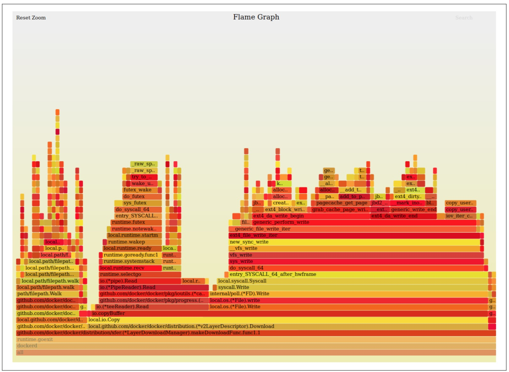

在软件工程中，跟踪是一种收集数据以进行概要分析和调试的方法。目的是在运行时提供有用的信息以供将来分析。使用BPF进行跟踪的主要优点是，您可以从Linux内核和应用程序访问几乎任何信息。与其他跟踪技术相比，BPF在系统性能和延迟方面增加了最少的开销，并且不需要开发人员修改应用程序只是为了从中收集数据。

Linux内核提供了一些可与BPF结合使用的检测功能。在本章中，我们将讨论这些不同的功能。我们向您展示了内核如何在操作系统中公开这些功能，从而使您知道如何找到BPF程序可用的信息。

跟踪的最终目标是通过收集所有可用数据并以有用的方式将其呈现给您，从而使您对任何系统都有深刻的了解。我们将讨论几种不同的数据表示形式，以及如何在不同的情况下使用它们。

从本章开始，我们将使用功能强大的工具包来编写BPF程序BPF编译器集合（BCC）。 BCC是使构建BPF程序更可预测的一组组件。即使您掌握了Clang和LLVM，您可能也不想花更多的时间来构建相同的实用程序，并确保BPF验证程序不会拒绝您的程序。 BCC为常见结构（如Perf事件映射）提供了可重用的组件，并与LLVM后端集成以提供更好的调试选项。最重要的是，BCC包含了几种编程语言的绑定。我们将在示例中使用Python。这些绑定使您可以用高级语言编写BPF程序的用户态部分，这将导致程序更有用。在以下各章中，我们还将使用BCC，以使示例更简洁。

能够跟踪Linux内核中的程序的第一步是确定它为您提供的附加BPF程序的扩展点。这些扩展点通常称为探针。

### 探针

英语词典中单词probe的定义之一如下：

```sh
    An unmanned exploratory spacecraft designed to transmit information about its
environment.
```

这个定义让人想起科幻电影和史诗般的NASA任务的记忆，也可能在您的脑海中。当我们谈论跟踪探针时，我们可以使用非常相似的定义。

```sh
    跟踪探针是探索性程序，旨在传输有关其执行环境的信息。
```

他们收集您系统中的数据，并提供给您进行探索和分析。传统上，在Linux中使用探针需要编写被编译为内核模块的程序，这可能会在生产系统中引起灾难性问题。多年来，它们进化为执行起来更安全，但编写和测试仍然很麻烦。诸如SystemTap之类的工具建立了新的协议来编写探针，并为从Linux内核和在用户态上运行的所有程序获取更丰富的信息铺平了道路。

BPF搭载在跟踪探针上以收集信息以进行调试和分析。 BPF程序的安全性使其比仍依赖于重新编译内核的工具更具吸引力。重新编译内核以包括外部模块可能会导致由于行为不当而导致崩溃的风险。 BPF验证程序通过在装入内核之前分析程序来消除此风险。 BPF开发人员利用了探针定义，并在代码执行找到这些定义之一时修改了内核以执行BPF程序，而不是内核模块。

了解您可以定义的不同探针类型是探索系统中正在发生的事情的基础。在本节中，我们对不同的探针定义，如何在系统中发现它们以及如何将BPF程序附加到它们进行分类。

在本章中，我们涵盖四种不同类型的探针：

*内核探针*

```sh
    这些使您可以动态访问内核中的内部组件。
```

*追踪点*

```sh
    这些提供对内核中内部组件的静态访问。
```

*用户态探针*

```sh
    这些使您可以动态访问在用户态中运行的程序。
```

*用户静态定义的跟踪点*

```sh
    这些允许静态访问在用户态中运行的程序。
```

#### 内核探针

### 可视化追踪数据

到目前为止，我们已经展示了在调试输出中打印数据的示例。这在生产环境中不是很有用。您想了解这些数据，但是没有人喜欢了解冗长而复杂的日志。如果我们要监控延迟和CPU使用率的变化，那么查看一段时间内的图表比汇总文件流中的数字更容易做到。

本节探讨了呈现BPF跟踪数据的不同方法。一方面，我们将向您展示BPF程序如何为您汇总信息。另一方面，您将学习如何以便携式表示形式导出该信息，以及如何使用现成的工具访问更丰富的表示形式并与他人共享您的发现。

#### 火焰图

火焰图是帮助您直观了解系统如何花费时间的图表。它们可以使您清楚地表示应用程序中的哪些代码执行频率更高。火焰图的创建者Brendan Gregg维护了一组脚本，可以在GitHub上轻松生成这些可视化格式。在本节后面的部分中，我们将使用这些脚本从BPF收集的数据生成火焰图。您可以在图4-1中看到这些图形。



关于火焰图显示的内容，有两点要记住：

- x轴按字母顺序排列。每个堆栈的宽度表示它在收集数据中出现的频率，可以将其与启用探查器时访问该代码路径的频率关联起来。

- y轴显示在探查器读取它们时保留的堆栈跟踪，并保留了跟踪层次。

最着名的火焰图代表系统中最频繁使用代码的CPU。这些称为 on-CPU 图。另一个有趣的火焰图可视化是非CPU图形。它们表示CPU在与您的应用程序无关的其他任务上花费的时间。通过组合CPU上和CPU外的图形，您可以完整了解系统在其上花费的CPU周期。

on-CPU 和 off-CPU均使用堆栈跟踪来指示系统在哪里花费时间。某些编程语言（例如Go）始终在其二进制文件中包含跟踪信息，而其他语言（例如C ++和Java）则需要做一些额外的工作才能使堆栈跟踪更易读。在您的应用程序包含堆栈跟踪信息之后，BPF程序可以使用它来汇总内核所看到的最频繁的代码路径。

*在内核中堆栈跟踪聚合有优缺点。一方面，这是一种计算堆栈跟踪频率的有效方法，因为它发生在内核中，避免了将每个堆栈信息发送到用户空间，并减少了内核与用户空间之间的数据交换。另一方面，为CPU外图表处理的事件数量可能会非常多，因为您要跟踪应用程序上下文切换期间发生的每个事件。如果尝试对它进行概要分析过长，则会在系统中产生大量开销。使用火焰图时请记住这一点。*

BCC提供了一些实用程序来帮助您聚合和可视化堆栈跟踪，但是主要的是宏BPF_STACK_TRACE。该宏生成BPF_MAP_TYPE_STACK_TRACE类型的BPF映射，以存储BPF程序累积的堆栈。最重要的是，该BPF映射得到了增强，该方法可以从程序的上下文中提取堆栈信息，并在汇总后使用它们时遍历累积的堆栈跟踪。

在下一个示例中，我们构建一个简单的BPF分析器，该分析器打印从用户空间应用程序收集的堆栈跟踪。我们使用探查器收集的轨迹生成on-CPU的火焰图。为了测试此事件探查器，我们将编写一个最小的Go程序来产生CPU负载。这是该最小应用程序的代码：

```go
    package main

    import "time"
    func main() { 
        j:=3
        for time.Since(time.Now()) < time.Second { 
            fori:=1;i<1000000;i++{
                j*=i 
            }
        } 
    }
```

如果将此代码保存在名为main.go的文件中，然后使用go run main.go对其进行运行，则会发现系统的CPU使用率显着提高。您可以通过按键盘上的Ctrl-C来停止执行，CPU使用率将恢复正常。

BPF程序的第一部分将初始化探查器结构：

```c
    bpf_source = """
    #include <uapi/linux/ptrace.h>
    #include <uapi/linux/bpf_perf_event.h>
    #include <linux/sched.h>
    struct trace_t {
        int stack_id;
    }
    BPF_HASH(cache, struct trace_t);
    BPF_STACK_TRACE(traces, 10000);
    """
```

- 初始化一个结构，该结构将为我们的探查器接收的每个堆栈帧存储参考标识符。我们稍后使用这些标识符来找出当时正在执行的代码路径。

- 初始化一个BPF哈希图，我们用它来汇总我们看到同一条痕迹帧的频率。火焰图脚本使用此汇总值来确定执行同一代码的频率。

- 初始化我们的BPF堆栈跟踪图。我们正在为此地图设置最大大小，但是它可能会根据您要处理的数据量而有所不同。最好将此值作为变量，但是我们知道Go应用程序不是很大，因此10,000个元素就足够了。

接下来，我们实现在分析器中聚合堆栈跟踪的功能：


```

#### 直方图

直方图是显示多个值范围出现频率的图表。表示该数值的数值数据分为多个存储桶，每个存储桶都包含该存储桶中任何数据点的出现次数。直方图测量的频率是每个桶的高度和宽度的组合。如果将桶分成相等的范围，则此频率与直方图的高度匹配，但是如果范围的划分不均等，则需要将每个高度乘以每个宽度，以找到正确的频率。

直方图是进行系统性能分析的基本组成部分。它们是表示可测量事件（例如指令等待时间）分布的好工具，因为它们向您显示的信息比其他测量（例如平均值）所获得的信息更正确。

BPF程序可以基于许多指标创建直方图。您可以使用BPF映射来收集信息，将其分类到存储桶中，然后为数据生成直方图表示。实现此逻辑并不复杂，但是如果您每次需要在分析程序输出时都要打印直方图，则变得很繁琐。 BCC提供了一个开箱即用的实现，您可以在每个程序中重用它，而不必每次都手动计算存储和频率。但是，内核源代码有一个很棒的实现，建议您在BPF示例中进行检查。

作为一个有趣的实验，我们将向您展示如何使用BCC直方图来可视化当应用程序调用bpf_prog_load指令时加载BPF程序引入的延迟。我们使用kprobes收集完成该指令所需的时间，然后将结果存储在直方图中，稍后我们将对其进行观察。我们将此示例分为几部分，以使其易于理解。

第一部分包括我们的BPF程序的初始资源：

```python
    bpf_source = """
    #include <uapi/linux/ptrace.h>

    BPF_HASH(cache, u64, u64);
    BPF_HISTOGRAM(histogram);

    int trace_bpf_prog_load_start(void ctx) {
      u64 pid = bpf_get_current_pid_tgid();
      u64 start_time_ns = bpf_ktime_get_ns();
      cache.update(&pid, &start_time_ns);

      return 0;
    } """
```


- 使用宏创建BPF哈希映射，以存储bpf_prog_load指令被触发时的初始时间。

- 使用新的宏来创建BPF直方图。这不是本机BPF映射； BCC包含此宏，使您可以更轻松地创建这些可视化文件。在后台，此BPF直方图使用数组映射来存储信息。它还有几个帮助程序来进行分类和创建最终图形。

- 当应用程序触发我们要跟踪的指令时，使用程序PID进行存储。（此功能对您来说很熟悉，我们之前的Uprobes示例中使用了它。）

让我们看看如何计算延迟的增量并将其存储在直方图中。

```python
    bpf_source += """

    int trace_bpf_prog_load_return(void ctx) {
      u64 *start_time_ns, delta;
      u64 pid = bpf_get_current_pid_tgid();
      start_time_ns = cache.lookup(&pid);
      if (start_time_ns == 0)
        return 0;
      delta = bpf_ktime_get_ns() - *start_time_ns;
      histogram.increment(bpf_log2l(delta));
      return 0;
    } """
```

- 计算指令被调用的时间与程序到达此处所需的时间之间的差值；我们可以假设这也是指令完成的时间。

- 将该增量存储在我们的直方图中。我们在此行中执行两项操作。首先，我们使用内置函数bpf_log2l生成增量值的存储桶标识符。此功能可随时间创建稳定的值分布。然后，我们使用递增功能将新项目添加到此存储桶。默认情况下，如果存储桶在直方图中已存在，则增量会将该值加1，否则会以1为值开始一个新存储桶，因此您不必担心该值是否预先存在。

我们需要编写的最后一段代码将这两个函数附加到有效的kprobes上，并在屏幕上打印直方图，以便我们可以看到延迟分布。这部分是我们初始化BPF程序的地方，我们等待事件生成直方图：

```pyhon

    bpf = BPF(text = bpf_source)
        bpf.attach_kprobe(event = "bpf_prog_load",
            fn_name = "trace_bpf_prog_load_start")
        bpf.attach_kretprobe(event = "bpf_prog_load",
            fn_name = "trace_bpf_prog_load_return")
    try: 
        sleep(99999999)
    except KeyboardInterrupt: 
        print()

    bpf["histogram"].print_log2_hist("msecs")

```

- 初始化BPF并将我们的功能附加到kprobes。

- 让我们的程序等待，以便我们可以从系统中收集尽可能多的事件。

- 使用跟踪的事件分布在终端中打印直方图，这是另一个BCC宏，它使我们能够获取直方图。

正如我们在本节开始时提到的那样，直方图对于观察系统中的异常现象很有用。 BCC工具包括许多脚本，这些脚本使用直方图来表示数据。我们强烈建议您在需要灵感来深入研究系统时查看它们。

### Perf 事件

我们认为，Perf事件可能是您成功掌握BPF跟踪所需要掌握的最重要的通信方法。在上一章中，我们讨论了BPF Perf事件数组映射。它们使您可以将数据放入与用户态程序实时同步的缓冲环中。当您在BPF程序中收集大量数据并希望将处理和可视化工作分流到用户态程序时，这是理想的选择。这将使您可以在表示层上进行更多控制，因为BPF VM在编程功能方面不受限制。您可以找到的大多数BPF跟踪程序仅将Perf事件用于此目的。

在这里，我们向您展示如何使用它们来提取有关二进制执行的信息，并对这些信息进行分类，以打印出系统中执行最多的二进制文件。我们将该示例分为两个代码块，以便您可以轻松地遵循该示例。在第一步中，我们定义BPF程序并将其附加到kprobe:

```c
    bpf_source = """
    #include <uapi/linux/ptrace.h>
    BPF_PERF_OUTPUT(events);

    int do_sys_execve(struct pt_regs *ctx, void filename, void argv, void envp) {
      char comm[16];
      bpf_get_current_comm(&comm, sizeof(comm));
      events.perf_submit(ctx, &comm, sizeof(comm));
      return 0; 
    }
    """
    bpf = BPF(text = bpf_source)
    execve_function = bpf.get_syscall_fnname("execve")
    bpf.attach_kprobe(event = execve_function, fn_name = "do_sys_execve")
```

在此示例的第一行中，我们将从Python的标准库中导入一个库。我们将使用Python计数器来汇总从BPF程序接收到的事件。

- 使用BPF_PERF_OUTPUT声明Perf事件映射。 BCC提供了一个方便的宏来声明这种映射。我们正在命名此映射事件。

- 在获得内核已执行的程序的名称之后，将其发送到用户态进行聚合。我们使用perf_submit来做到这一点。此功能使用我们的新信息来更新Perf事件映射。

- 初始化BPF程序，并将其附加到在我们的系统中执行新程序时要触发的kprobe上。

现在，我们已经编写了代码来收集在系统中执行的所有程序，我们需要在用户态中聚合它们。下一个代码段中有很多信息，因此我们将引导您完成最重要的几行：

```python
    from collections import Counter 
    aggregates = Counter()

    def aggregate_programs(cpu, data, size): 
        comm = bpf["events"].event(data) 
        aggregates[comm] += 1

    bpf["events"].open_perf_buffer(aggregate_programs) 
    while True:
        try: 
            bpf.perf_buffer_poll()
        except KeyboardInterrupt: 
            break

    for (comm, times) in aggregates.most_common(): 
        print("Program {} executed {} times".format(comm, times))
```

- 声明一个计数器来存储我们的程序信息。我们使用程序的名称作为键，值将为计数器。我们使用aggregate_programs函数从Perf事件映射中收集数据。在此示例中，您可以看到我们如何使用BCC宏访问映射并从堆栈顶部提取下一个传入的数据事件。

- 增加我们收到的具有相同程序名称的事件的次数。

- 使用函数open_perf_buffer告诉BCC每次它从Perf事件映射中接收到一个事件时，都需要执行函数gregation_programs。

- 在打开环形缓冲区之后，BCC会轮询事件，直到我们中断此Python程序为止。您等待的时间越长，将要处理的信息越多。您可以看到我们如何为此目的使用perf_buffer_poll。

- 使用most_common函数可获取计数器中的元素列表，并循环执行以先打印系统中执行效果最佳的程序。

Perf事件可以打开以全新且出乎意料的方式处理BPF公开的所有数据的大门。我们向您展示了一个示例，可以在您需要从内核收集某种任意数据时激发您的想象力；您可以在BCC提供的跟踪工具中找到许多其他示例。


### 结论

在本章中，我们仅介绍了使用BPF进行跟踪的内容。 Linux内核使您可以访问使用其他工具更难获得的信息。 BPF使此过程更具可预测性，因为它提供了访问此数据的通用接口。在后面的章节中，您将看到更多使用此处介绍的某些技术的示例，例如将函数附加到跟踪点。他们将帮助您巩固您在这里学到的知识。

我们在本章中使用BCC框架来编写大多数示例。您可以像在前几章中一样在C中实现相同的示例，但是BCC提供了一些内置功能，这些功能使编写跟踪程序比C更加容易。如果您遇到有趣的挑战，请尝试用C重写这些示例。

在下一章中，我们将向您展示系统社区基于BPF构建的一些工具，用于进行性能分析和跟踪。编写自己的程序功能强大，但是这些专用工具可让您访问打包格式的许多信息。这样，您无需重写已经存在的工具。