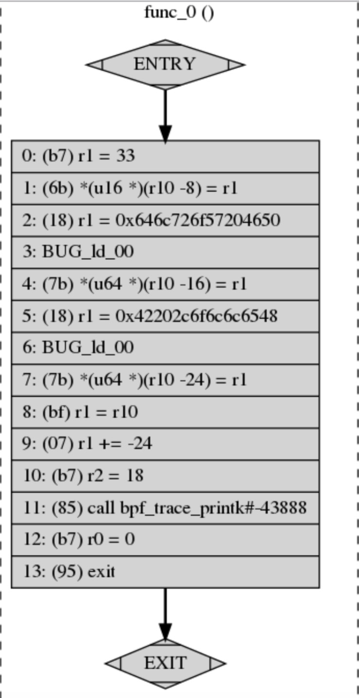

到目前为止，我们已经讨论了如何编写BPF程序以在系统中获得更多可视性。多年来，许多开发人员已经出于相同的目的使用BPF构建了工具。在本章中，我们将讨论您每天可以使用的几种现成的工具。其中许多工具都是您已经看到的某些BPF程序的高级版本。其他工具则可以帮助您直接了解自己的BPF程序。

本章介绍了一些工具，这些工具可以帮助您使用BPF进行日常工作。我们首先介绍BPFTool，这是一个命令行实用程序，可获取有关BPF程序的更多信息。我们介绍了BPFTrace和kubectl-trace，它们将帮助您使用简洁的领域特定语言（DSL）来更高效地编写BPF程序。最后，我们讨论eBPF Exporter，这是一个将BPF与Prometheus集成的开源项目。

### BPFTool


BPFTool是一个内核实用程序，用于检查BPF程序和映射。默认情况下，该工具未安装在任何Linux发行版中，并且正在大量开发中，因此您需要编译最能支持Linux内核的版本。我们介绍了随Linux内核5.1版一起分发的BPFTool版本。

在下一节中，我们讨论如何将BPFTool安装到您的系统上以及如何使用它来观察和更改终端上BPF程序和映射的行为。

#### 安装

要安装BPFTool，您需要下载内核源代码的副本。可能会为您的特定Linux发行版提供一些软件包，但由于它不太复杂，因此我们将介绍如何从源代码安装它。

1.使用Git通过git clone https://github.com/torvalds/linux从GitHub克隆存储库。

2.使用git checkout v5.1签出特定的内核版本标记。

3.在内核的源代码中，导航到BPFTool的源代码所在的目录
用cd tools/bpf/bpftool存储。

4.使用make && sudo make install编译并安装此工具。

您可以通过检查BPFTool的版本来检查其安装是否正确：

```sh
    # bpftool --version
    bpftool v5.1.0
```

#### 特性展示

您可以使用BPFTool执行的基本操作之一是扫描系统，以了解您可以访问哪些BPF功能。当您不记得哪个版本的内核引入了哪种程序或是否启用了BPF JIT编译器时，这非常有用。要找出这些问题以及其他许多问题的答案，请运行以下命令：

```sh
    # bpftool feature
```

您会得到很长的输出，其中包含有关系统中所有受支持的BPF功能的详细信息。为简便起见，我们在此处显示该输出的裁剪版本：

```sh
    Scanning system configuration...
    bpf() syscall for unprivileged users is enabled
    JIT compiler is enabled
    ...
    Scanning eBPF program types...
    eBPF program_type socket_filter is available
    eBPF program_type kprobe is NOT available
    ...
    Scanning eBPF map types...
    eBPF map_type hash is available
    eBPF map_type array is available
```

在此输出中，您可以看到我们的系统允许非特权用户执行syscall bpf，该调用仅限于某些操作。您还可以看到已启用JIT。默认情况下，较新版本的内核启用此JIT，它在编译BPF程序方面有很大帮助。如果您的系统未启用它，则可以运行以下命令将其启用：

```sh
    # echo 1 > /proc/sys/net/core/bpf_jit_enable
```

功能输出还向您显示系统中启用了哪些程序类型和映射类型。该命令提供的信息比我们在此显示的信息要多得多，例如程序类型和许多其他配置指令支持的BPF帮助器。在探索您的系统时，可以随意研究它们。

了解可用的特性会很有用，特别是在需要深入研究未知系统的情况下。这样，我们就可以继续使用其他有趣的BPFTool功能，例如检查加载的程序。

#### 检查BPF程序

BPFTool为您提供有关内核上BPF程序的直接信息。它使您可以调查系统中已经在运行的内容。它还允许您加载和固定以前从命令行编译的新BPF程序。

学习如何使用BPFTool处理程序的最佳起点是检查系统中正在运行的程序。为此，您可以运行命令bpftool prog show。如果您使用Systemd作为初始化系统，则可能已经加载了一些BPF程序并将其附加到某些cgroup；我们稍后再讨论。运行该命令的输出将如下所示：

```sh
    52: cgroup_skb  tag 7be49e3934a125ba
            loaded_at 2019-03-28T16:46:04-0700  uid 0
            xlated 296B  jited 229B  memlock 4096B  map_ids 52,53
    53: cgroup_skb  tag 2a142ef67aaad174
            loaded_at 2019-03-28T16:46:04-0700  uid 0
            xlated 296B  jited 229B  memlock 4096B  map_ids 52,53
    54: cgroup_skb  tag 7be49e3934a125ba
            loaded_at 2019-03-28T16:46:04-0700  uid 0
            xlated 296B  jited 229B  memlock 4096B  map_ids 54,55
```

冒号前的左侧数字是程序标识符；我们稍后将使用它们来研究这些程序的全部用途。从此输出中，您还可以了解系统正在运行哪种程序。在这种情况下，系统正在运行连接到cgroup套接字缓冲区的三个BPF程序。如果这些程序实际上是由Systemd启动的，则加载时间很可能与您引导系统时的时间相同。您还可以查看这些程序当前正在使用多少内存以及与它们关联的映射的标识符。乍一看，所有这些都是有用的，并且由于我们拥有程序标识符，因此我们可以进一步深入研究。

您可以将程序标识符作为附加参数添加到上一个命令：bpftool prog show id52。这样，BPFTool将向您显示相同的信息。
您之前看到过，但仅针对ID 52标识的程序；这样，您可以过滤掉不需要的信息。此命令还支持--json标志以生成一些JSON输出。如果要操作输出，此JSON输出非常方便。例如，jq之类的工具将为您提供此数据更结构化的格式。

```sh
    # bpftool prog show --json id 52 | jq
   {
    "id":52,
    "type":"cgroup_skb",
    "tag":"7be49e3934a125ba",
    "gpl_compatible":false,
    "loaded_at":1553816764,
    "uid":0,
    "bytes_xlated":296,
    "jited":true,
    "bytes_jited":229,
    "bytes_memlock":4096,
    "map_ids":[
        52,
        53
    ]
}
```

您还可以执行更高级的操作，并仅过滤您感兴趣的信息。在下一个示例中，我们仅对了解BPF程序标识符，它是哪种程序类型以及何时将其加载到BPF中感兴趣：

```sh
    # bpftool prog show --json id 52 | jq -c '[.id, .type, .loaded_at]'
    [52,"cgroup_skb",1553816764]
```


当您知道程序标识符时，您还可以使用BPFTool获取整个程序的dump。当您需要调试由编译器生成的BPF字节码时，这会很方便：

```sh
    # bpftool prog dump xlated id 52
       0: (bf) r6 = r1
       1: (69) r7 = *(u16 *)(r6 +192)
       2: (b4) w8 = 0
       3: (55) if r7 != 0x8 goto pc+14
       4: (bf) r1 = r6
       5: (b4) w2 = 16
       6: (bf) r3 = r10
       7: (07) r3 += -4
       8: (b4) w4 = 4
       9: (85) call bpf_skb_load_bytes#7151872
       ...
```

Systemd在内核中加载的该程序正在使用辅助程序 bpf_skb_load_bytes 检查数据包数据。

如果要更直观地表示此程序，包括指令跳转，可以在此命令中使用visual关键字。这将生成一种输出格式，您可以使用诸如dotty之类的工具或任何其他可以绘制图形的程序将其转换为图形表示形式：

```sh
    # bpftool prog dump xlated id 52 visual &> output.out
    # dot -Tpng output.out -o visual-graph.png
```

您可以在图5-1中看到小型Hello World程序的视觉表示。



如果您运行的是5.1版或更高版本的内核，则还可以访问运行时统计信息。他们告诉您内核在BPF程序上花费了多长时间。默认情况下，您的系统中可能未启用此功能。您需要先运行此命令，以使内核知道需要向您显示该数据：

```sh
    # sysctl -w kernel.bpf_stats_enabled=1
```

启用统计信息后，运行BPFTool时，您将获得另外两条信息：内核用于运行该程序的总时间（run_time_ns），以及运行该程序的次数（run_cnt）：

```sh
    52: cgroup_skb  tag 7be49e3934a125ba  run_time_ns 14397 run_cnt 39
            loaded_at 2019-03-28T16:46:04-0700  uid 0
            xlated 296B  jited 229B  memlock 4096B  map_ids 52,53
```

但是BPFTool不仅允许您检查程序的运行情况，它还允许您将新程序加载到内核中，并将其中一些附加到套接字和cgroup。例如，我们可以使用以下命令加载以前的程序之一并将其固定到BPF文件系统：

```sh
    # bpftool prog load bpf_prog.o /sys/fs/bpf/bpf_prog
```

由于该程序已固定到文件系统，因此它在运行后不会终止，并且我们可以看到它仍使用先前的show命令加载：

```sh
    # bpftool prog show
    52: cgroup_skb  tag 7be49e3934a125ba
            loaded_at 2019-03-28T16:46:04-0700  uid 0
            xlated 296B  jited 229B  memlock 4096B  map_ids 52,53
    53: cgroup_skb  tag 2a142ef67aaad174
            loaded_at 2019-03-28T16:46:04-0700  uid 0
            xlated 296B  jited 229B  memlock 4096B  map_ids 52,53
    54: cgroup_skb  tag 7be49e3934a125ba
            loaded_at 2019-03-28T16:46:04-0700  uid 0
            xlated 296B  jited 229B  memlock 4096B  map_ids 54,55
    60: perf_event  name bpf_prog  tag c6e8e35bea53af79
            loaded_at 2019-03-28T20:46:32-0700  uid 0
            xlated 112B  jited 115B  memlock 4096B
```

如您所见，BPFTool为您提供了许多有关内核中加载的程序的信息，而无需编写和编译任何代码。接下来，让我们看看如何使用BPF映射。

#### 检查 BPF 映射

除了使您能够访问检查和操作BPF程序之外，BPFTool还可以使您访问那些程序正在使用的BPF映射。列出所有映射和按其标识符过滤映射的命令与您之前看到的show命令相似。让我们不要让BPFTool显示编的信息，而是让它向我们显示映射的信息：

```sh
    # bpftool map show
    52: lpm_trie  flags 0x1
            key 8B  value 8B  max_entries 1  memlock 4096B
    53: lpm_trie  flags 0x1
            key 20B  value 8B  max_entries 1  memlock 4096B
 
    54: lpm_trie  flags 0x1
            key 8B  value 8B  max_entries 1  memlock 4096B
    55: lpm_trie  flags 0x1
            key 20B  value 8B  max_entries 1  memlock 4096B
```

这些映射与您先前在程序上看到的标识符匹配。您也可以按照映射的ID过滤映射，就像我们之前通过程序的ID过滤程序一样。

您可以使用BPFTool创建和更新映射，并列出映射中的所有元素。创建新映射需要与初始化映射以及其中一个程序时提供的信息相同。我们需要指定要创建的映射类型，键和值的大小及其名称。因为我们没有将映射与程序一起初始化，所以我们还需要将其固定到BPF文件系统，以便以后使用：

```sh
    # bpftool map create /sys/fs/bpf/counter
        type array key 4 value 4 entries 5 name counter
```

如果您在运行该命令后在系统中列出了映射，则会在列表底部看到新映射：

```sh
    52: lpm_trie  flags 0x1
            key 8B  value 8B  max_entries 1  memlock 4096B
    53: lpm_trie  flags 0x1
            key 20B  value 8B  max_entries 1  memlock 4096B
    54: lpm_trie  flags 0x1
            key 8B  value 8B  max_entries 1  memlock 4096B
    55: lpm_trie  flags 0x1
            key 20B  value 8B  max_entries 1  memlock 4096B
    56: lpm_trie  flags 0x1
            key 8B  value 8B  max_entries 1  memlock 4096B
    57: lpm_trie  flags 0x1
            key 20B  value 8B  max_entries 1  memlock 4096B
    58: array  name counter  flags 0x0
            key 4B  value 4B  max_entries 5  memlock 4096B
```

创建映射后，您可以像在BPF程序中一样更新和删除元素。

*请记住，您不能从固定大小的数组中删除元素；您只能更新它们。但是您可以从其他映射（例如哈希映射）中完全删除元素。*

如果要向映射添加新元素或更新现有元素，则可以使用map update命令。您可以从上一个示例中获取映射标识符：

```sh
    # bpftool map update id 58 key 1 0 0 0 value 1 0 0 0
```

如果您尝试使用无效的键或值更新元素，则BPFTool将返回错误：

```sh
    # bpftool map update id 58 key 1 0 0 0 value 1 0 0
    Error: value expected 4 bytes got 3
```

如果需要检查BPFTool的值，可以将其转储给您。您可以看到BPF在创建固定大小的数组映射时如何将所有元素初始化为空值：

```sh
    # bpftool map dump id 58
    key: 00 00 00 00 value: 00 00 00 00
    key: 01 00 00 00 value: 01 00 00 00
    key: 02 00 00 00 value: 01 00 00 00
    key: 03 00 00 00 value: 01 00 00 00
    key: 04 00 00 00 value: 01 00 00 00
```

BPFTool给您提供的最强大的选项之一是，您可以将预先创建的映射附加到新程序，然后将这些初始化的映射替换为那些预先分配的映射。这样，即使您没有编写程序来从BPF文件系统中读取映射，也可以从头开始使程序访问已保存的数据。为此，您需要设置在使用BPFTool加载程序时要初始化的映射。您可以通过程序加载时将使用的有序标识符来指定映射，例如，第一个映射为0，第二个映射为1，依此类推。您还可以通过其名称指定映射，这通常更方便：

```sh
    # bpftool prog load bpf_prog.o /sys/fs/bpf/bpf_prog_2 \
        map name counter /sys/fs/bpf/counter
```

在此示例中，我们将刚刚创建的映射附加到新程序。在这种情况下，我们用其名称替换该映射，因为我们知道程序会初始化一个称为counter的映射。您也可以将映射的索引位置与关键字idx一起使用，例如idx 0，以便于记住。

当您需要实时调试消息传递时，直接从命令行访问BPF映射非常有用。 BPFTool使您可以方便地直接访问。除了自省程序和映射，您还可以使用BPFTool从内核中提取更多信息。接下来，让我们看看如何访问特定的接口。

#### 检查附着到特定接口的程序

有时您会发现自己想知道哪些程序连接到特定的接口。 BPF可以加载在cgroup，Perf事件和网络数据包之上运行的程序。子命令cgroup，perf和net可以帮助您追溯这些接口上的附件。

perf子命令列出了连接到系统跟踪点的所有程序，例如kprobes，uprobes和tracepoint。您可以通过运行bpftool perf show查看清单。

net子命令列出了附加到XDP和流量控制的程序。其他附件，例如套接字过滤器和复用端口程序，只能使用iproute2进行访问。您可以使用bpftool net show列出XDP和TC的附件，就像在其他BPF对象中看到的一样。

最后，cgroup子命令列出了附加到cgroups的所有程序。该子命令与您看到的其他命令有些不同。 bpftool cgroup show需要您要检查的cgroup的路径。如果要列出系统中所有cgroup中的所有附件，则需要使用bpftool cgroup树，如以下示例所示：

```sh
    # bpftool cgroup tree
    CgroupPath
    ID       AttachType      AttachFlags     Name
    /sys/fs/cgroup/unified/system.slice/systemd-udevd.service
5 ingress
        4        egress
    /sys/fs/cgroup/unified/system.slice/systemd-journald.service
3 ingress
        2        egress
    /sys/fs/cgroup/unified/system.slice/systemd-logind.service
        7        ingress
        6        egress
```

借助BPFTool，您可以验证程序是否正确连接到内核中的任何接口，从而可以快速查看cgroup，Perf和网络接口。

到目前为止，我们已经讨论了如何在终端中输入不同的命令来调试BPF程序的行为。但是，在最需要它们时记住所有这些命令可能很麻烦。接下来，我们将描述如何从纯文本文件中加载多个命令，以便您可以构建一组便于使用的脚本，而不必保留我们所讨论的每个选项。

#### 以批处理方式加载命令

在尝试分析一个或多个系统的行为时，经常要反复运行多个命令。您可能最终会得到一系列在工具链中经常使用的命令。如果您不想每次都键入BPFTool的批处理模式，则可以使用它们。

使用批处理模式，您可以将要执行的所有命令写入文件，然后一次运行所有命令。您也可以在文件中以＃开头写注释。但是，此执行模式不是原子的。
命令逐行执行，如果其中一个命令失败，它将中止执行，使系统保持运行最新成功命令后的状态。

这是批处理模式可以处理的文件的简短示例：

```sh
    # Create a new hash map
    map create /sys/fs/bpf/hash_map type hash key 4 value 4 entries 5 name hash_map
    # Now show all the maps in the system
    map show
```

如果您将这些命令保存在名为/tmp/batch_example.txt的文件中，则可以使用bpftool批处理文件/tmp/batch_example.txt加载该命令。首次运行此命令时，您将获得与以下代码段相似的输出，但是如果再次尝试运行该命令，则该命令将不显示任何输出，因为我们已经在其中包含了名称为hash_map的映射，并且批处理执行将在第一行中失败：

```sh
    # bpftool batch file /tmp/batch_example.txt
    2: lpm_trie  flags 0x1
            key 8B  value 8B  max_entries 1  memlock 4096B
    3: lpm_trie  flags 0x1
            key 20B  value 8B  max_entries 1  memlock 4096B
    18: hash  name hash_map  flags 0x0
            key 4B  value 4B  max_entries 5  memlock 4096B
    processed 2 commands
```

批处理模式是BPFTool中我们最喜欢的选项之一。我们建议将这些批处理文件保存在版本控制系统中，以便您可以与团队共享它们，以创建自己的实用工具集。在转到我们的下一个最受欢迎的实用程序之前，让我们看一下BPFTool如何帮助您更好地理解BPF类型格式。

#### 展示 BTF 信息

当存在任何给定的二进制对象时，BPFTool可以显示BPF类型格式（BTF）信息。正如我们在第2章中提到的那样，BTF使用元数据信息来注释程序结构，以帮助您调试程序。
例如，当您将关键字linum添加到prog dump时，它可以为您提供BPF程序中每个指令的源文件和行号。

BPFTool的最新版本包括一个新的btf子命令，以帮助您深入了解程序。该命令的最初重点是可视化结构类型。例如，bpftool btf dump id 54显示了加载ID为54的程序的所有BFT类型。

这些是您可以使用BPFTool进行处理的东西。不过对于任何系统来说这些是比较少用到的，特别是如果您每天不使用该系统。

### BPFTrace

BPFTrace是BPF的高级跟踪语言。它使您可以用简洁的DSL编写BPF程序，并将它们另存为可以执行的脚本，而无需手动编译并加载到内核中。该语言的灵感来自其他知名工具，例如awk和DTrace。如果您熟悉DTrace，并且总是想念不能在Linux上使用它，那么您将在BPFTrace中找到一个很好的替代品。

与使用BCC或其他BPF工具直接编写程序相比，使用BPFTrace的优势之一是BPFTrace提供了许多内置功能，这些功能您不需要自己实现，例如，汇总信息和创建历史记录。另一方面，BPFTrace使用的语言受到更多限制，如果您尝试实现高级程序，它将妨碍您的使用。在本节中，我们向您展示语言的最重要方面。我们建议转到[GitHub上的BPFTrace存储库](https://github.com/iovisor/bpftrace)以了解它。

#### 安装

尽管BPFTrace的开发人员建议您为特定的Linux发行版使用预构建的软件包之一，但是您可以通过几种方式安装BPFTrace。他们还将在其存储库中维护包含所有安装选项和系统先决条件的文档。在那里，您会在[安装文档](https://github.com/iovisor/bpftrace/blob/master/INSTALL.md)中找到说明。

#### 语言参考


BPFTrace执行的程序具有简洁的语法。我们可以将它们分为三部分：页眉，操作块和页脚。头文件是BPFTrace在加载程序时执行的特殊块。它通常用于在输出的顶部打印一些信息，例如前导。同样，页脚是BPFTrace在终止程序之前执行一次的特殊块。页眉和页脚都是BPFTrace程序中的可选部分。 BPFTrace程序必须至少具有一个动作块。操作块是我们指定要跟踪的探针以及内核为这些探针触发事件时执行的操作的位置。下一个代码段在一个基本示例中向您展示了这三个部分：

```sh
    BEGIN
    {
      printf("starting BPFTrace program\n")
    }

    kprobe:do_sys_open
    {
      printf("opening file descriptor: %s\n", str(arg1))
    }
 
    END
    {
      printf("exiting BPFTrace program\n")
    }
```

程序开始始终标有关键字BEGIN，程序结束始终标有关键字END。这些关键字由BPFTrace保留。操作块标识符定义了您要将BPF操作附加到的探针。在前面的示例中，每次内核打开文件时，我们都会打印一条日志行。

除了标识程序部分外，我们还可以在前面的示例中看到有关语言语法的更多详细信息。 BPFTrace提供了一些帮助程序，这些帮助程序在编译程序时会转换为BPF代码。辅助程序printf是C函数printf的包装，可在需要时打印程序详细信息。 str是一个内置帮助程序，它将C指针转换为其字符串表示形式。许多内核函数将指向字符的指针作为参数接收；该帮助程序会为您将这些指针转换为字符串。

从某种意义上讲，BPFTrace不知道探针在内核执行时可能会收到的参数数量，因此可以将其视为动态语言。这就是BPFTrace提供参数助手以访问内核处理的信息的原因。 BPFTrace根据块接收的参数数量动态生成这些帮助程序，您可以通过其在参数列表中的位置来访问信息。在上一个示例中，arg1是对打开的syscall中第二个参数的引用，该文件引用了文件路径。

要执行此示例，可以将其保存在文件中，并以文件路径作为第一个参数运行BPFTrace：

```sh
    # bpftrace /tmp/example.bt
```


BPFTrace的语言在设计时就考虑了脚本编写。在前面的示例中，您已经看到了该语言的简洁版本，因此您可以熟悉它。但是，您可以使用BPFTrace编写的许多程序只能放在一行上。您无需将这些单行程序存储在文件中即可执行它们。您可以在执行BPFTrace时使用-e选项运行它们。例如，通过将操作块折叠为一行，上一个计数器示例可以是单行代码：

```sh
    # bpftrace -e "kprobe:do_sys_open { @opens[str(arg1)] = count() }"
```

现在，您对BPFTrace的语言有了更多了解，让我们看看如何在几种情况下使用它。

#### 过滤

当您运行前面的示例时，您可能会得到系统不断打开的文件流，直到您按Ctrl-C退出程序为止。那是因为我们要告诉BPF打印内核打开的每个文件描述符。在某些情况下，您只想针对特定条件执行操作块。 BPFTrace调用该过滤。

您可以将一个过滤器关联到每个操作块。它们像动作块一样被评估，但是如果过滤器返回错误值，则动作不执行。他们还可以访问其他语言，包括探针参数和帮助器。这些过滤器封装在动作标头后的两个斜杠内：

```sh
    kprobe:do_sys_open /str(arg1) == "/tmp/example.bt"/
    {
      printf("opening file descriptor: %s\n", str(arg1))
    }
```

在此示例中，我们改进了操作块，使其仅在内核正在打开的文件是用于存储此示例的文件时才执行。如果您使用新的过滤器运行该程序，则会看到它会打印标题，但会在此处停止打印。这是因为现在有了新的过滤器，所有之前触发我们操作的文件都将被跳过。如果您在其他终端上多次打开示例文件，则会看到当过滤器与我们的文件路径匹配时内核如何执行操作：

```sh
    # bpftrace /tmp/example.bt
    Attaching 3 probes...
    starting BPFTrace program
    opening file descriptor: /tmp/example.bt
    opening file descriptor: /tmp/example.bt
    opening file descriptor: /tmp/example.bt
    ^Cexiting BPFTrace program
```

BPFTrace的过滤功能非常有用，可以隐藏您不需要的信息，使数据的范围保持在您真正关心的范围内。接下来，我们讨论BPFTrace如何使映射的无缝处理。

#### 动态映射

BPFTrace实现的一项便捷功能是动态映射关联。它可以动态生成BPF映射，您可以将其用于整本书中看到的许多操作。所有映射关联均以字符@开头，后跟要创建的映射的名称。您还可以通过为其分配值来关联这些映射中的更新元素。

如果以开始本节的示例为例，则可以汇总系统打开特定文件的频率。为此，我们需要计算内核在特定文件上运行open syscall的次数，然后将这些计数器存储在映射中。为了识别这些集合，我们可以使用文件路径作为映射的键。在这种情况下，这是我们的操作块的具体代码：

```sh
    kprobe:do_sys_open
    {

        @opens[str(arg1)] = count()
    }
```

如果再次运行程序，将得到类似以下的输出：

```sh
    # bpftrace /tmp/example.bt
    Attaching 3 probes...
    starting BPFTrace program
    ^Cexiting BPFTrace program
    @opens[/var/lib/snapd/lib/gl/haswell/libdl.so.2]: 1
    @opens[/var/lib/snapd/lib/gl32/x86_64/libdl.so.2]: 1
    ...
    @opens[/usr/lib/locale/en.utf8/LC_TIME]: 10
    @opens[/usr/lib/locale/en_US/LC_TIME]: 10
    @opens[/usr/share/locale/locale.alias]: 12
    @opens[/proc/8483/cmdline]: 12
```


如您所见，BPFTrace在停止执行程序时将打印映射的内容。正如我们期望的那样，它汇总了内核在系统中打开文件的频率。默认情况下，BPFTrace始终将在终止时打印其创建的每个映射的内容。您无需指定要打印映射；它始终假定您要。您可以通过使用内置函数clear清除END块内的映射来更改该行为。之所以可行，是因为打印映射总是在执行页脚块之后发生。

BPFTrace动态映射超级方便。它消除了处理映射所需的许多样板，并致力于帮助您轻松地收集数据。

BPFTrace是执行日常任务的强大工具。它的脚本语言为您提供了足够的灵活性来访问系统的各个方面，而无需进行手动将BPF程序编译和加载到内核的仪式，这可以帮助您从一开始就跟踪和调试系统中的问题。 请查看其GitHub存储库中的参考指南，以了解如何利用其所有内置功能，例如自动直方图和堆栈跟踪聚合。

在下一节中，我们将探讨如何在Kubernetes中使用BPFTrace。

### kubectl-trace

kubectl-trace是Kubernetes命令行kubectl的绝佳插件。它可以帮助您在Kubernetes集群中调度BPFTrace程序，而无需安装任何其他程序包或模块。它通过安排一个带有容器镜像的Kubernetes作业来做到这一点，该镜像具有运行已安装程序所需的一切。该镜像称为跟踪运行器，也可以在公共Docker注册表中使用。

#### 安装

您需要使用Go的工具链从其源存储库安装kubectl-trace，因为其开发人员未提供任何二进制软件包：

```sh
    go get -u github.com/iovisor/kubectl-trace/cmd/kubectl-trace
```
Go的工具链编译该程序并将其放入路径后，kubectl的插件系统将自动检测到此新插件。 kubectl-trace会在您第一次执行它时自动下载它需要在您的集群中运行的Docker镜像。

#### 检测 Kubernetes node 节点

您可以使用kubectl-trace来定位运行容器的节点和容器，也可以使用它来定位在这些容器上运行的进程。在第一种情况下，您几乎可以运行任何所需的BPF程序。但是，在第二种情况下，您只能运行将用户态探针附加到那些进程的程序。

如果要在特定节点上运行BPF程序，则需要一个适当的标识符，以便Kubernetes在适当的位置安排作业。有了该标识后，运行该程序与运行您先前看到的程序类似。这是我们运行计数打开文件数的方式：

```sh
    # kubectl trace run node/node_identifier -e \
      "kprobe:do_sys_open { @opens[str(arg1)] = count() }"
```

如您所见，程序完全相同，但是我们使用命令kubectl trace run将其安排在特定的群集节点中。我们使用语法 node/... 来告诉kubectl-trace我们正在针对集群中的一个节点。如果要定位到特定的pod，可以将node/替换为pod/。

在特定容器上运行程序需要更长的语法；让我们先看一个示例并进行以下操作：

```sh
    # kubectl trace run pod/pod_identifier -n application_name -e <<PROGRAM
    uretprobe:/proc/$container_pid/exe:"main.main" {
      printf("exit: %d\n", retval)
    }
    PROGRAM
```

在此命令中有两点需要强调。首先，我们需要在容器中运行的应用程序的名称，以便能够找到其进程。这与我们的示例中的application_name相对应。您需要使用在容器中执行的二进制文件的名称，例如nginx或memc ached。通常，容器仅运行一个进程，但这为我们额外保证了我们将程序附加到正确的进程上。要强调的第二个方面是在我们的BPF程序中包含$ container_pid。这不是BPFTrace帮助程序，而是kubectl-trace用来替代流程标识符的占位符。在运行BPF程序之前，跟踪运行器将占位符替换为适当的标识符，并将其附加到正确的过程中。

如果您在生产环境中运行Kubernetes，当您需要分析容器的行为时，kubectl-trace将使您的生活更加轻松。

在本节和前几节中，我们重点介绍了即使在容器环境中也可以帮助您更高效地运行BPF程序的工具。在下一节中，我们将讨论一个很好的工具，它将从BPF程序收集的数据与Prometheus（著名的开源监视系统）集成在一起。


### eBPF Exporter

eBPF Exporter是一个工具，可用于将自定义BPF跟踪指标导出到Prometheus。 Prometheus是高度可扩展的监视和警报系统。使Prometheus与其他监视系统不同的一个关键因素是，它使用拉取策略来获取指标，而不是期望客户端将指标推向该指标。这允许用户编写可从任何系统收集指标的自定义导出器，Prometheus将使用定义良好的API模式将其提取。 eBPF Exporter实现了此API，以从BPF程序中获取跟踪指标并将其导入Prometheus。

#### 安装

尽管eBPF Exporter提供了二进制程序包，但我们建议从源代码安装它，因为通常没有新版本。从源代码构建还使您可以访问基于BCC现代版本BPF编译器集合构建的更新功能。

要从源代码安装eBPF Exporter，您需要在计算机上安装BCC和Go的工具链。通过这些先决条件，您可以使用Go为您下载并构建二进制文件：

```sh
    go get -u github.com/cloudflare/ebpf_exporter/...
```

#### 从 BPF 导出指标

eBPF Exporter是使用YAML文件配置的，您可以在其中指定要从系统中收集的指标，生成这些指标的BPF程序以及它们如何转换为Prometheus。当Prometheus向eBPF Exporter发送请求以提取指标时，此工具会将BPF程序正在收集的信息转换为指标值。幸运的是，eBPF Exporter捆绑了许多程序，这些程序从您的系统收集非常有用的信息，例如每周期指令（IPC）和CPU缓存命中率。

eBPF Exporter的简单配置文件包括三个主要部分。在第一部分中，您定义了您希望Prometheus从系统中提取的指标。在这里，您可以将BPF映射中收集的数据转换为Promthetheus可以理解的指标。以下是该项目示例中的这些翻译示例：

```yaml

    programs:
      - name: timers
        metrics: 
          counters:
            - name: timer_start_total
              help: Timers fired in the kernel 
              table: counts
              labels:
                - name: function 
                size: 8
                decoders:
                  - name: ksym
```

我们定义了一个名为timer_start_total的指标，该指标汇总了内核启动计时器的频率。我们还指定我们要从称为计数的BPF映射中收集此信息。最后，我们为映射键定义翻译功能。这是必需的，因为映射键通常是信息的指针，并且我们希望向Prometheus发送实际的函数名称。

本示例的第二部分描述了我们要将BPF程序附加到的探针。在这种情况下，我们要跟踪计时器的启动调用。我们为此使用tracepoint timer：timer_start：

```sh
    tracepoints:
          timer:timer_start: tracepoint__timer__timer_start
```

在这里，我们告诉eBPF Exporter，我们要将BPF函数跟踪点__timer__timer_start附加到此特定跟踪点。接下来，让我们看看如何声明该函数：

```sh
    code: |
        BPF_HASH(counts, u64);
        // Generates function tracepoint__timer__timer_start TRACEPOINT_PROBE(timer, timer_start) {
            counts.increment((u64) args->function);
            return 0; 
        }

```

BPF程序内嵌在YAML文件中。这可能是该工具中我们最不喜欢的部分之一，因为YAML专门针对whitespacing，但它适用于此类小程序。 eBPF Exporter使用BCC来编译程序，因此我们可以访问其所有宏和帮助程序。上一个代码片段使用宏TRACEPOINT_PROBE生成最终函数，该函数将附加到跟踪点，并命名为tracepoint__timer__timer_start。

Cloudflare使用eBPF Exporter监控其所有数据中心的指标。该公司确保捆绑了您要从系统中导出的最常见指标。但是如您所见，使用新指标进行扩展相对容易。

### 结论

在本章中，我们讨论了一些我们最喜欢的系统分析工具。这些工具足够通用，可以在需要调试系统上的任何异常情况时使用。如您所见，所有这些工具都抽象了我们在前几章中看到的概念，即使在环境尚未准备就绪时也可以帮助您使用BPF。这是BPF在其他分析工具之前的众多优势之一。因为任何现代Linux内核都包括BPF VM，所以您可以在上面构建利用这些强大功能的新工具。

还有许多其他将BPF用于类似目的的工具，例如Cilium和Sysdig，我们建议您尝试使用它们。

本章和第4章主要讨论系统分析和跟踪，但是BPF可以做很多事情。在接下来的章节中，我们将深入探讨其网络功能。我们向您展示了如何分析任何网络中的流量以及如何使用BPF控制网络中的消息。


