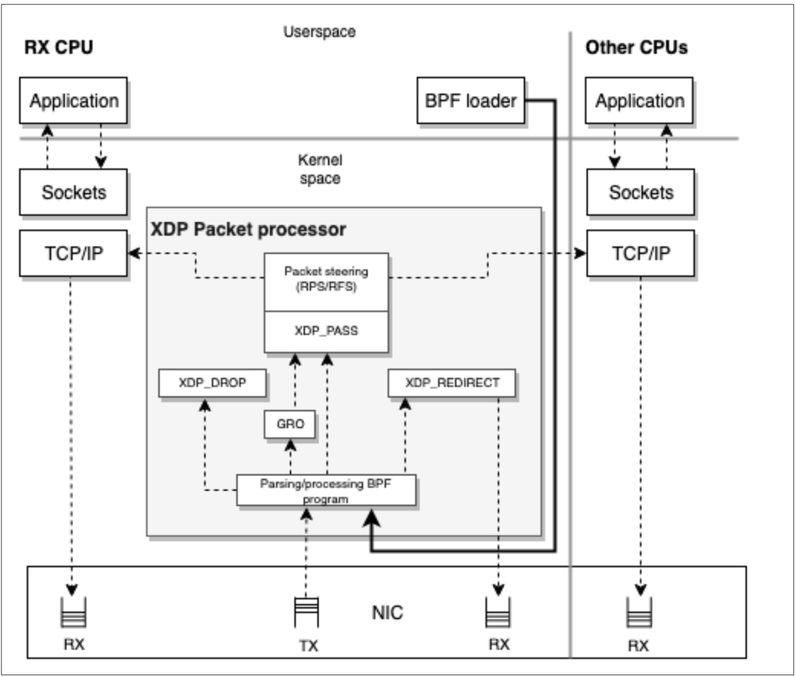
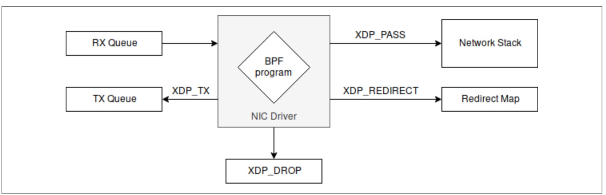

XDP是Linux网络数据路径中的一种安全，可编程，高性能，内核集成的数据包处理器，当NIC驱动程序接收到数据包时，它将执行BPF程序。这使XDP程序可以在最早的时间点做出有关接收到的数据包的决定（丢弃，修改或允许它）。

执行点并不是使XDP程序快速运行的唯一方面。以下几个方面也扮演了很重要的角色：

- 使用XDP进行数据包处理时，没有内存分配。
- XDP程序仅适用于线性，无碎片的数据包，并且具有数据包的开始和结束指针。
- 无法访问完整的数据包元数据，这就是为什么这种程序接收的输入上下文的类型为xdp_buff而不是您在第6章中遇到的sk_buff结构的原因。
- 因为它们是eBPF程序，所以XDP程序的执行时间有限，其结果是它们的使用在网络管道中具有一定的成本。

*xdp_buff结构用于将数据包上下文呈现给BPF程序，该程序使用XDP框架提供的直接数据包访问机制。将其视为sk_buff的“轻量级”版本。两者之间的区别在于sk_buff也可以保留，并允许您与数据包的元数据（原型，标记，类型）混合，这些元数据仅在网络管道的更高级别可用。 xdp_buff提早创建且不依赖于其他内核层的事实是使用XDP更快地获取和处理数据包的原因之一。另一个原因是，xdp_buff不像对使用sk_buff的程序类型那样保存对路由，流量控制钩子或其他类型的数据包元数据的引用。*

在谈论XDP时，重要的是要记住它不是内核旁路机制。它旨在与其他内核组件和内部Linux安全模型集成。

在本章中，我们将探讨XDP程序的特性，各种XDP程序以及如何编译和加载它们。此后，为了提供更多背景信息，我们讨论了它的实际用例。

### XDP 程序总览

本质上，XDP程序所做的接收到的数据包之后，然后编辑接收到的数据包的内容或仅返回结果码。结果码用于确定对数据包做什么操作。您可以丢弃数据包，可以将其发送到同一接口，也可以将其传递到其余的网络栈。此外，为了与网络栈合作，XDP程序可以推送和拉取数据包的报头。例如，如果当前内核不支持封装格式或协议，则XDP程序可以对其进行解封装或转换协议，然后将结果发送给内核进行处理。

但是，XDP和eBPF之间有什么关联？

事实证明，XDP程序是通过bpf syscall控制的，并使用程序类型`BPF_PROG_TYPE_XDP`进行加载。同样，驱动程序钩子执行BPF字节码。

编写XDP程序时要理解的一个重要概念是，它们将在其中运行的上下文也称为操作模式。

#### 操作模式

XDP具有三种操作模式，可以轻松地测试功能，供应商提供的定制硬件以及没有定制硬件的通用内核。让我们逐一介绍它们。

##### 原生XDP

这是默认模式。在这种模式下，XDP BPF程序直接在网络驱动程序的早期接收路径之外运行。使用此模式时，检查驱动程序是否支持它很重要。您可以通过对给定内核版本的源代码树执行以下命令来检查它：

```sh
    # Clone the linux-stable repository
    git clone git://git.kernel.org/pub/scm/linux/kernel/git/stable/linux-stable.git\
    linux-stable
    # Checkout the tag for your current kernel version
    cd linux-stable
    git checkout tags/v4.18
    # Check the available drivers
    git grep -l XDP_SETUP_PROG drivers/
```

执行之后有如下输出：

```sh
    drivers/net/ethernet/broadcom/bnxt/bnxt_xdp.c
    drivers/net/ethernet/cavium/thunder/nicvf_main.c
    drivers/net/ethernet/intel/i40e/i40e_main.c
    drivers/net/ethernet/intel/ixgbe/ixgbe_main.c
    drivers/net/ethernet/intel/ixgbevf/ixgbevf_main.c
    drivers/net/ethernet/mellanox/mlx4/en_netdev.c
    drivers/net/ethernet/mellanox/mlx5/core/en_main.c
    drivers/net/ethernet/netronome/nfp/nfp_net_common.c
    drivers/net/ethernet/qlogic/qede/qede_filter.c
    drivers/net/netdevsim/bpf.c
    drivers/net/tun.c
    drivers/net/virtio_net.c
```

从我们可以看到，内核4.18支持以下内容：

- Broadcom NetXtreme-C/E 网络驱动程序bnxt。

- Cavium thunderx 驱动。

- Inteli40 驱动。

- Intel ixgbe 和 ixgvevf  驱动。

- Mellanox mlx4 和 mlx5 驱动。

- Netronome Network Flow Processor。

- QLogic qede NIC 驱动。

- TUN/TAP。

- Virtio。

了解了原生操作模式后，我们可以继续了解如何使用 offloaded XDP 由网卡直接处理XDP程序。

##### Offloaded XDP

在这种模式下，XDP BPF程序直接加载到NIC中，而不是在主机CPU上执行。通过将执行移出CPU，与本地XDP相比，此模式具有高性能的特点。

通过查找 XDP_SETUP_PROG_HW，我们可以重用刚刚克隆的内核源代码树，以检查4.18中的哪些NIC驱动程序支持硬件offload：

```sh
git grep -l XDP_SETUP_PROG_HW drivers/
```

然后应该可以看到类似下面的内容：

```sh
    include/linux/netdevice.h
    866:    XDP_SETUP_PROG_HW,
    net/core/dev.c
    8001:           xdp.command = XDP_SETUP_PROG_HW;
    drivers/net/netdevsim/bpf.c
    200:    if (bpf->command == XDP_SETUP_PROG_HW && !ns->bpf_xdpoffload_accept) {
    205:    if (bpf->command == XDP_SETUP_PROG_HW) {
    560:    case XDP_SETUP_PROG_HW:
    drivers/net/ethernet/netronome/nfp/nfp_net_common.c
    3476:   case XDP_SETUP_PROG_HW:

```

这表明 Netronome网络流处理器（nfp），这意味着它还可以通过支持硬件offload和本机XDP来在两种模式下运行。

现在，对您自己来说一个好问题是，当我没有网卡和驱动程序来尝试XDP程序时该怎么办？答案很简单，通用XDP！

##### 通用XDP

对于想要编写和运行XDP程序而又没有本机或offloaded的XDP功能的开发人员，这是一种测试模式。从内核版本4.12开始支持通用XDP。例如，您可以在所有设备上使用此模式-在后面的示例中，我们将使用此模式来展示XDP的功能，而无需购买特定的硬件。


但是，谁负责所有组件和操作模式之间的协调？继续下一节以了解有关分组处理器的信息。

#### 包处理器

XDP数据包处理器是使XDP数据包上可以执行BPF程序并协调它们与网络栈之间的交互的角色。数据包处理器是XDP程序的内核组件，当NIC呈现数据包时，它们直接处理接收（RX）队列上​​的数据包。它可确保数据包可读可写，并允许您以数据包处理器操作的形式附加后处理判决。原子程序更新和向程序包处理器的新程序加载可以在运行时完成，而不会因网络和相关流量而中断任何服务。在运行时，XDP可以在“繁忙轮询”模式下使用，从而使您可以保留将必须处理每个RX队列的CPU。这避免了上下文切换，并且无论IRQ关联如何，都可以在到达时立即进行数据包反应。 XDP可以使用的另一种模式是“中断驱动”模式，另一方面，它不保留CPU，而是指示充当事件介质的中断来通知CPU它必须在发生新事件时处理新事件。仍在进行正常处理。


在图7-1中，您可以在RX/TX，应用程序，数据包处理器和应用于其数据包的BPF程序之间的交互点中看到。

请注意，在图7-1中有一些正方形，前面有一个字符串，前面带有XDP_。这些是XDP结果代码，我们接下来将介绍。



#### XDP 结果码 (包处理器操作)

包处理器对于包的处理结果，可以使用五个返回码之一来表示，然后可以告诉网络驱动程序如何处理该包。让我们深入研究包处理器执行的操作：

**Drop (XDP_DROP)**

丢弃数据包。这发生在驱动程序的最早的RX阶段。丢弃数据包仅意味着将其回收回到刚刚“到达”的RX环形队列中。对于拒绝服务（DoS）缓解用例而言，尽早丢弃数据包是关键。这样，丢弃的数据包将使用最少的CPU处理时间和功耗。

**Forward (XDP_TX)**

转发数据包。这可能在修改数据包之前或之后发生。转发数据包意味着将收到的数据包页面退回到它之前到达的同一NIC。

**Redirect (XDP_REDIRECT)**

与XDP_TX相似，它能够传输XDP数据包，但是它可以将数据包转发到另一个NIC或BPF cpumap中。对于BPF cpumap，在NIC的接收队列上为XDP服务的CPU可以继续这样做，并将数据包推送到远程CPU之后该包将被上层内核堆栈处理。这类似于XDP_PASS，但是具有XDP BPF程序可以继续为传入的高负载提供服务的能力，而不是暂时将工作花费在当前数据包上以推送到上层。

**Pass (XDP_PASS)**

将数据包传递到普通网络栈进行处理。这等效于没有XDP的默认数据包处理行为。这可以通过以下两种方式之一来完成：

- 正常接收， 分配元数据（sk_buff），将数据包接收到堆栈上，然后将数据包引导到另一个CPU进行处理。它允许到用户态的原始接口。这可能在数据包被修改之前或之后发生。

- 通用接收 offload（GRO）， 可以执行大数据包的接收并合并相同连接的数据包。 GRO处理后最终将数据包通过“正常接收”流。

**Code error (XDP_ABORTED)**

表示eBPF程序错误，并导致数据包被丢弃。函数程序不应该将它用作返回代码。例如，如果程序除以零，则将返回XDP_ABORTED。 XDP_ABORTED的值将始终为零。它通过trace_xdp_exception追踪点，可以对其进行额外监视以检测不良行为。

这些操作代码在linux/bpf.h头文件中表示如下：

```c
enum xdp_action {
        XDP_ABORTED = 0,
        XDP_DROP,
        XDP_PASS,
        XDP_TX,
        XDP_REDIRECT,
};
```

由于XDP操作决定了不同的行为，并且是数据包处理器的内部机制，因此您可以查看图7-1的简化版本，其中仅着眼于返回操作（请参见图7-2）。



关于XDP程序的一个有趣的事情是，您通常不需要编写加载程序来加载它们。通过ip命令实现的大多数Linux机器都有一个不错的加载程序。下一节将介绍如何使用它。

### XDP and iproute2 作为加载器


